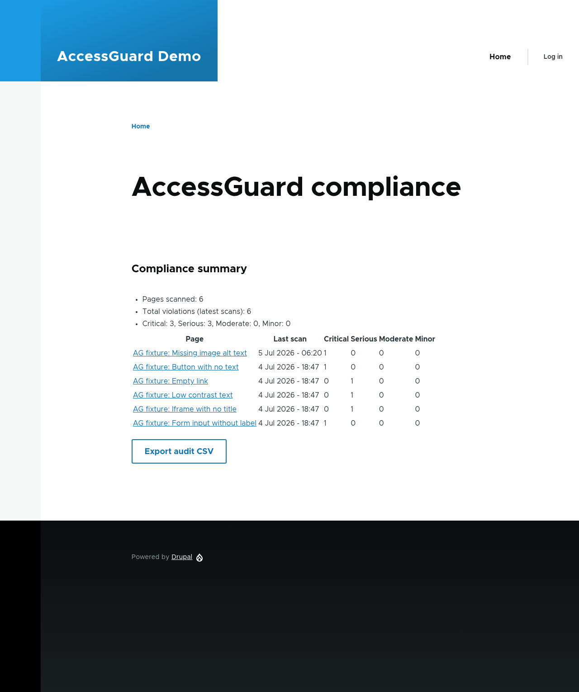

# AccessGuard

**Accessibility compliance governance for Drupal, built on axe-core.**

Government and enterprise websites are legally required to meet WCAG 2.2 / Section 508, but content authors introduce accessibility violations constantly, and existing tools only ever tell you what's broken *right now* on *one page*. AccessGuard turns point-in-time detection into continuous, accountable governance inside Drupal.

> **axe-core tells you what's broken. AccessGuard makes an organization stay accountable for fixing it.**



---

## Why this exists

Every California state agency (and any organization under Section 508) must prove ongoing accessibility compliance. The detection problem is solved. What isn't solved, in the open-source Drupal world, is the *governance* layer: scanning a whole site continuously, tracking violations over time, blocking bad content from publishing, attributing issues to authors, and producing audit-ready reports.

AccessGuard deliberately **does not reinvent detection**. It integrates [axe-core](https://github.com/dequelabs/axe-core), the industry-standard accessibility engine, and builds the accountability system on top. Using the proven engine instead of rebuilding it is an intentional engineering decision.

## Architecture

```
Author saves / publishes a node
        │
        ▼
Drupal (AccessGuard module, PHP)
  • enqueues a scan job (Queue API)
  • QueueWorker calls the scanner
        │  HTTP POST { url }
        ▼
Node scanner microservice (Puppeteer + axe-core), a ddev service
  • headless Chromium loads the real rendered URL
  • runs axe-core with the WCAG 2.2 AA ruleset
  • returns JSON violations
        │  JSON
        ▼
Drupal stores results as entities → compliance dashboard
```

The Node scanner is intentionally minimal (URL in, violations out). All governance logic lives in the Drupal/PHP module.

## How it compares to Lighthouse / pa11y

Lighthouse's accessibility audit *uses axe-core under the hood* (a curated subset of its rules), so this is **not** a claim of a better detection engine. Two things are genuinely different:

1. **Coverage** — AccessGuard runs the full WCAG 2.2 AA ruleset, not a subset.
2. **Capability** — this is the real point:

| Capability | Lighthouse | pa11y | AccessGuard |
|---|:---:|:---:|:---:|
| Single-page detection | ✅ | ✅ | ✅ |
| Full WCAG 2.2 AA ruleset | subset | partial | ✅ |
| Results stored & tracked over time | ❌ | ❌ | ✅ |
| Site-wide compliance dashboard | ❌ | ❌ | ✅ |
| Publish-gating / enforcement | ❌ | ❌ | ✅ |
| Author attribution | ❌ | ❌ | ✅ |
| Audit-ready report export | ❌ | ❌ | ✅ |

See `benchmark/RESULTS.md` for an empirical detection comparison on the demo fixtures (run it yourself: `cd benchmark && npm install && npm run benchmark`).

## Security

The scanner loads arbitrary URLs in a real browser, a classic SSRF risk. By default it **only** allows `http`/`https` and **blocks** private, loopback, link-local, CGNAT, and reserved IP ranges. Scanning internal/private hosts (like your own Drupal site on a private network) requires explicitly opting in via `SCANNER_ALLOW_PRIVATE=1` — secure by default, explicit override for trusted networks. The guard runs on **every** request the page makes (the navigation, any redirects, and subresources) via request interception, and the validated IP is **pinned into Chromium** (`--host-resolver-rules`) so a DNS-rebinding attack can't swap the target between validation and connection.

## Quick start

Requires [DDEV](https://ddev.readthedocs.io/) and Docker.

```bash
# 1. Start the environment (also builds the scanner service)
ddev start                       # tip: on Windows, DDEV_NONINTERACTIVE=true ddev start
ddev composer install

# 2. Install Drupal and the modules
ddev drush site:install standard -y
ddev drush en accessguard accessguard_demo -y   # demo installs 6 planted-violation pages

# 3. Scan the demo pages
for nid in $(ddev drush php:eval '$q=\Drupal::entityTypeManager()->getStorage("node")->getQuery()->accessCheck(FALSE)->execute(); print implode(" ", $q);'); do
  ddev drush accessguard:scan $nid --now
done

# 4. View the compliance dashboard
ddev drush uli    # opens an admin login link
# then browse to /admin/reports/accessguard
```

You should see all six demo pages, each with the accessibility violation it was seeded with (`image-alt`, `button-name`, `link-name`, `color-contrast`, `frame-title`, `label`).

## What's built

- **Node scanner** (`scanner/`) — axe-core in headless Chromium behind an HTTP endpoint, with an SSRF guard. 9 tests.
- **`accessguard` module**
  - `accessguard_scan` and `accessguard_violation` entities
  - `ScanRunner` (calls the scanner), `ScanRecorder` (persists results), and `RegressionService` (diffs a node's two latest scans) services
  - a queue worker and a `drush accessguard:scan` command
  - **cron site-wide re-scanning** of stale/unscanned published nodes
  - a **compliance dashboard** at `/admin/reports/accessguard`, plus per-node detail pages with scan history, regression diff (new / fixed / persisting), and author attribution
  - **publish-gating**: an entity validation constraint that blocks publishing a node whose latest scan has violations at/above a configured severity threshold (bypassable with a permission)
  - **CSV audit export** (formula-injection-safe) at `/admin/reports/accessguard/export`
  - a **settings form** at /admin/config/system/accessguard
- **`accessguard_demo` module** — a content type plus six pages, each seeded with one reliable WCAG violation, for exercising the pipeline.
- **`benchmark/`** — a harness comparing AccessGuard's axe (WCAG 2.2 AA) against pa11y (and optionally Lighthouse) on the fixtures.

## Roadmap

- PDF audit export and richer per-rule / per-author analytics.
- Concurrency-limited browser pooling in the scanner (reuse instances under load).

## Tech stack

Drupal 11, PHP 8.3+, Node.js, Puppeteer, axe-core, ddev/Docker. PHPUnit (Drupal) and Jest (scanner) tests.

## Testing

```bash
# Scanner (Node)
cd scanner && npm install && npm test

# Drupal module (from repo root)
ddev exec vendor/bin/phpunit -c web/core web/modules/custom/accessguard/tests/src/Unit/ScanRunnerTest.php
ddev exec bash -c "SIMPLETEST_DB=mysql://db:db@db/db vendor/bin/phpunit -c web/core web/modules/custom/accessguard/tests/src/Kernel/ScanRecorderTest.php"
```
