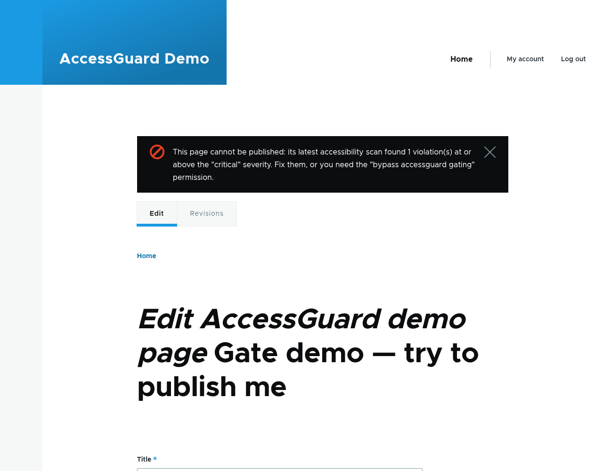
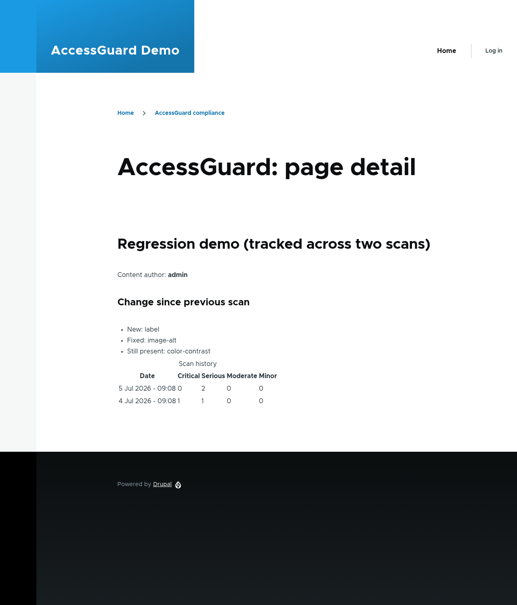
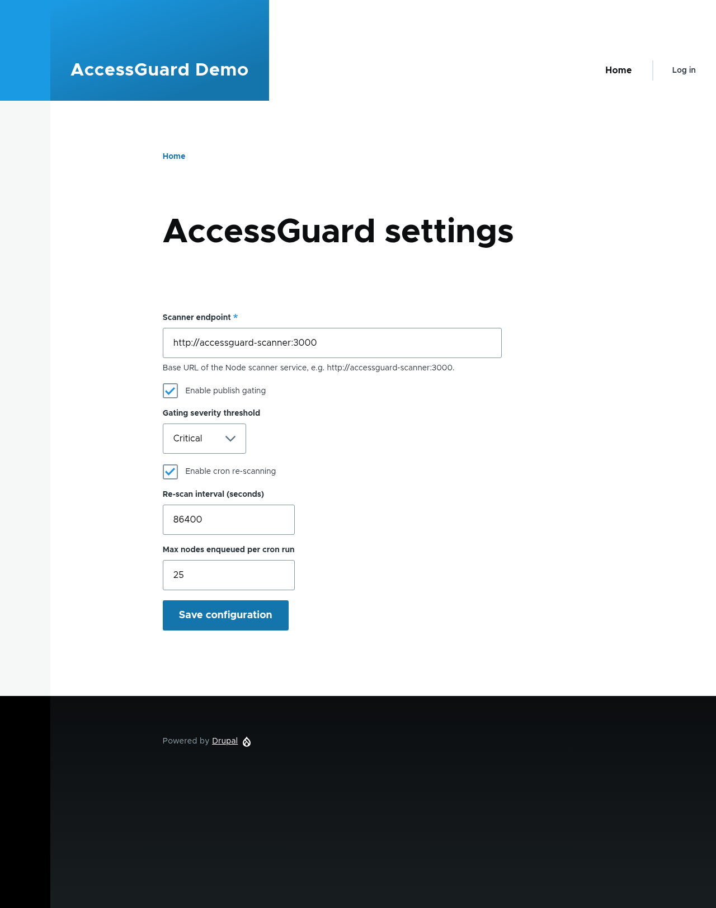

# AccessGuard


**Accessibility compliance governance for Drupal, built on axe-core.**

Government and enterprise websites are legally required to meet WCAG 2.2 / Section 508, but content authors introduce accessibility violations constantly, and existing tools only ever tell you what's broken *right now* on *one page*. AccessGuard turns point-in-time detection into continuous, accountable governance inside Drupal.

> **axe-core tells you what's broken. AccessGuard makes an organization stay accountable for fixing it.**


---

## Why this exists

Every California state agency (and any organization under Section 508 or the ADA Title II web rule) must keep its sites accessible and show ongoing effort. (The DOJ's ADA Title II rule sets **WCAG 2.1 AA**, with compliance dates — extended in April 2026 — of **April 26, 2027** for populations ≥50k and **April 26, 2028** otherwise.) The *detection* problem is largely solved by axe-core. What isn't solved, in the open-source Drupal world, is the *governance* layer: scanning a whole site continuously, tracking violations over time, blocking regressions from publishing, attributing issues to authors, and producing audit evidence to feed a formal review.

AccessGuard deliberately **does not reinvent detection**. It integrates [axe-core](https://github.com/dequelabs/axe-core), the industry-standard accessibility engine, and builds the accountability system on top. Using the proven engine instead of rebuilding it is an intentional engineering decision.

## Architecture

```
Author saves / publishes a node
        │
        ▼
Drupal (AccessGuard module, PHP)
  • enqueues a scan job (Queue API)
  • QueueWorker calls the scanner
        │  HTTP POST { url }
        ▼
Node scanner microservice (Puppeteer + axe-core), a ddev service
  • headless Chromium loads the real rendered URL
  • runs axe-core with the WCAG 2.2 AA ruleset
  • returns JSON violations
        │  JSON
        ▼
Drupal stores results as entities → compliance dashboard
```

The Node scanner is intentionally minimal (URL in, violations out). All governance logic lives in the Drupal/PHP module.

## How it compares to Lighthouse / pa11y

Lighthouse's accessibility audit *uses axe-core under the hood* (a curated subset of its rules), so this is **not** a claim of a better detection engine. Two things are genuinely different:

1. **Coverage** — AccessGuard runs axe-core's full *automated* WCAG 2.2 A/AA ruleset, where Lighthouse ships a curated subset of it.
2. **Capability** — this is the real point:

| Capability | Lighthouse | pa11y | AccessGuard |
|---|:---:|:---:|:---:|
| Single-page detection | ✅ | ✅ | ✅ |
| Full automated axe ruleset (vs. a subset) | subset | partial | ✅ |
| Results stored & tracked over time | ❌ | ❌ | ✅ |
| Site-wide dashboard | ❌ | ❌ | ✅ |
| Publish-gating / enforcement | ❌ | ❌ | ✅ |
| Author attribution | ❌ | ❌ | ✅ |
| Audit report export | ❌ | ❌ | ✅ |

`benchmark/RESULTS.md` shows a detection sanity check on the demo fixtures (run it yourself: `cd benchmark && npm install && npm run benchmark`). One honest caveat: all six fixtures target rules that are *inside* Lighthouse's axe subset, so the harness demonstrates detection parity on common rules — the full-ruleset coverage advantage (point 1 above) follows from axe's WCAG 2.2 AA ruleset being a superset, not from these fixtures.

### What automated scanning can and can't do

Automated testing is a floor, not a ceiling. axe (like every automated engine) has rules for roughly **23 of the 55 WCAG 2.2 A/AA success criteria (~42%)**, and only a handful comprehensively — it catches an estimated **30–57% of issues**. The rest (captions, meaningful sequence, focus order and visibility, reflow, non-text contrast, error handling, and 6 of the 7 new WCAG 2.2 criteria) require **manual expert review**. A page that passes AccessGuard's gate is free of *automatically-detectable* failures — it is **not** certified WCAG-conformant. AccessGuard's job is to govern and continuously track the automatable layer and route the rest to humans; it feeds a manual audit, it doesn't replace one.

## Security

The scanner loads arbitrary URLs in a real browser, a classic SSRF risk. By default it **only** allows `http`/`https` and **blocks** private, loopback, link-local, CGNAT, and reserved IP ranges. Scanning internal/private hosts (like your own Drupal site on a private network) requires explicitly opting in via `SCANNER_ALLOW_PRIVATE=1` — secure by default, explicit override for trusted networks. The guard runs on **every** request the page makes (the navigation, any redirects, and subresources) via request interception, and each request is fulfilled over a connection **pinned to the exact IP that was validated** (DNS is consulted once, by the guard), so a DNS-rebinding attack can't swap the target between validation and connection — on any request, not just the first. Both the scan and PDF endpoints can require a shared-secret token (`SCANNER_AUTH_TOKEN` on the service, matched on the Drupal side by the settings form or the `ACCESSGUARD_SCANNER_TOKEN` environment variable) so only your Drupal site can drive it.

## Quick start

Requires [DDEV](https://ddev.readthedocs.io/) and Docker.

```bash
# 1. Start the environment (also builds the scanner service)
ddev start                       # tip: on Windows, DDEV_NONINTERACTIVE=true ddev start
ddev composer install

# 2. Install Drupal and the modules
ddev drush site:install standard -y
ddev drush en accessguard accessguard_demo -y   # demo installs 6 planted-violation pages

# 3. Scan the demo pages
for nid in $(ddev drush php:eval '$q=\Drupal::entityTypeManager()->getStorage("node")->getQuery()->accessCheck(FALSE)->execute(); print implode(" ", $q);'); do
  ddev drush accessguard:scan $nid --now
done

# 4. View the compliance dashboard
ddev drush uli    # opens an admin login link
# then browse to /admin/reports/accessguard
```

You should see all six demo pages, each with the accessibility violation it was seeded with (`image-alt`, `button-name`, `link-name`, `color-contrast`, `frame-title`, `label`).

## What's built

- **Node scanner** (`scanner/`) — axe-core in headless Chromium behind an HTTP endpoint, with an SSRF guard, plus a PDF-rendering endpoint for audit reports, with a concurrency-capped shared-browser pool (per-request isolated contexts, crash recovery, idle teardown via `SCANNER_BROWSER_IDLE_MS`). 52 tests.
- **`accessguard` module**
  - `accessguard_scan` and `accessguard_violation` entities
  - `ScanRunner` (calls the scanner), `ScanRecorder` (persists results), and `RegressionService` (diffs a node's two latest scans) services
  - a queue worker and a `drush accessguard:scan` command
  - a **CI gate**: `drush accessguard:gate` evaluates the publish-gate policy (threshold, waivers, needs-review setting) against every published node that has a scan and exits non-zero if anything blocks — wire it into CI to fail a build on accessibility regressions. Pass a node id to check one node; use `--format=json` for machine-readable output. Runs even when the interactive gate is disabled.
  - **cron site-wide re-scanning** of stale/unscanned published nodes
  - a **compliance dashboard** at `/admin/reports/accessguard`, plus per-node detail pages with scan history, regression diff (new / fixed / persisting), and author attribution
  - **publish-gating**: an entity validation constraint that blocks publishing a node whose latest scan has violations at/above a configured severity threshold (bypassable with a permission)
  - **CSV audit export** (formula-injection-safe) at `/admin/reports/accessguard/export`, plus a formal **PDF audit report** (cover, compliance summary, per-rule / per-author breakdowns, and per-page findings with waiver justifications) rendered by the scanner
  - **per-rule and per-author analytics** as dashboard tabs (Overview / By rule / By author) — surface which rules cause the most violations site-wide and which authors' content needs attention
  - **violation triage**: waive false-positives / accepted-risks (matched by rule+selector across scans); waived issues stop blocking the gate and are flagged in the audit export
  - a **settings form** at /admin/config/system/accessguard
- **`accessguard_demo` module** — a content type plus six pages, each seeded with one reliable WCAG violation, for exercising the pipeline.
- **`benchmark/`** — a harness comparing AccessGuard's axe (WCAG 2.2 AA) against pa11y (and optionally Lighthouse) on the fixtures.

## Screenshots

**Publish-gating** — a content editor is blocked from publishing a page that failed its scan (superusers with the bypass permission can override):



**Per-page detail** — scan history, the regression diff (new / fixed / still-present), and author attribution:



**Settings** — configure the scanner, gate threshold, and cron re-scanning:



A sample exported audit report is at [`docs/sample-audit.csv`](docs/sample-audit.csv).

## Tech stack

Drupal 11, PHP 8.3+, Node.js, Puppeteer, axe-core, ddev/Docker. PHPUnit (Drupal) and Jest (scanner) tests.

## Testing

```bash
# Scanner (Node)
cd scanner && npm install && npm test

# Drupal module (from repo root)
ddev exec vendor/bin/phpunit -c web/core web/modules/custom/accessguard/tests/src/Unit/ScanRunnerTest.php
ddev exec bash -c "SIMPLETEST_DB=mysql://db:db@db/db vendor/bin/phpunit -c web/core web/modules/custom/accessguard/tests/src/Kernel/ScanRecorderTest.php"
```
